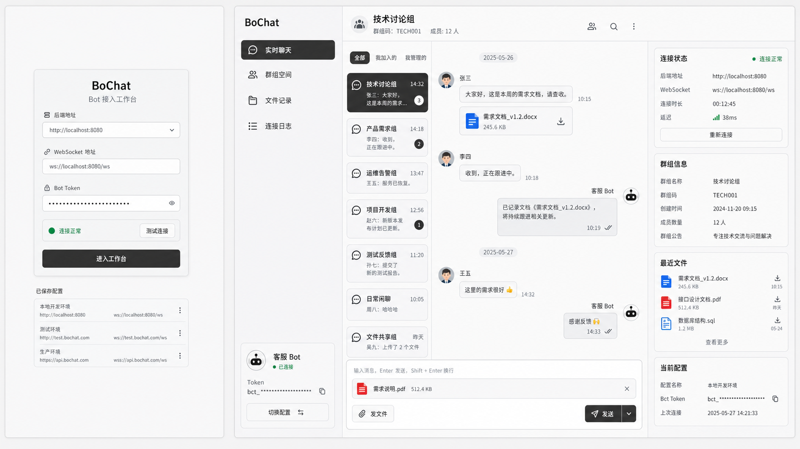

# Bot 用户前端静态改造指南

参考设计图：

## 目标

在现有 `ui-vue` 前端基础上，做一个面向 Bot 用户的 Web 界面静态改造。用户通过填写后端地址、WebSocket 地址和 Bot Token 进入工作台；进入后可看到群聊列表、消息区、文件消息样式、发送输入区和连接状态信息。

本阶段只完成前端 UI 和交互壳，不接真实后端，不新增真实业务功能。

## 技术现状

- 项目路径：`ui-vue`
- 技术栈：Vue 3、Vite、TypeScript、Pinia、Vue Router、Naive UI、lucide-vue-next
- 现有主视觉：浅灰背景、灰白面板、细边框、黑灰主按钮、紧凑后台工具界面
- 现有核心文件：
  - `src/views/LoginView.vue`
  - `src/views/ChatView.vue`
  - `src/components/Common/TopNav.vue`
  - `src/components/Chat/BotGroupSelector.vue`
  - `src/components/Chat/MessageList.vue`
  - `src/components/Chat/MessageItem.vue`
  - `src/components/Chat/MessageInput.vue`
  - `src/globals.css`

## 改造范围

只改前端展示层：

- 可以新增静态页面、静态 Store、Mock 数据、展示组件。
- 可以调整路由，让 `/login` 和 `/chat` 呈现 Bot 用户版本。
- 可以增加本地表单状态、选中群聊状态、假消息列表、假文件列表。
- 不调用真实接口。
- 不修改后端。
- 不实现真实 WebSocket。
- 不实现真实上传、下载、鉴权、群聊发送。

## 页面结构

### 1. Bot 登录配置页

建议基于 `src/views/LoginView.vue` 改造。

页面元素：

- 标题：`BoChat`
- 副标题：`Bot 接入工作台`
- 输入项：
  - `后端地址`
  - `WebSocket 地址`
  - `Bot Token`
- 状态行：
  - 绿色状态点
  - `连接正常` 或 `等待测试`
- 按钮：
  - 次按钮：`测试连接`
  - 主按钮：`进入工作台`
- 下方可放一个紧凑的最近配置列表，例如：
  - `本地开发环境`
  - `测试环境`

行为要求：

- 点击 `测试连接` 只切换静态状态，不请求接口。
- 点击 `进入工作台` 只跳转 `/chat`。
- Token 输入框默认用 password 类型或局部脱敏展示。

### 2. Bot 群聊工作台

建议基于 `src/views/ChatView.vue` 改造。

整体布局：

- 左侧导航栏：沿用 `TopNav.vue` 风格。
- 主区域：沿用当前 `ChatView.vue` 的灰白面板、边框和紧凑布局。
- 群聊选择、群信息和输入区在窄列中呈现。
- 消息列表作为主要阅读区域。

左侧导航：

- Brand：`BoChat`
- 在线绿色状态点
- 菜单项：
  - `实时聊天`，当前激活
  - `群组空间`
  - `文件记录`
  - `连接日志`
- 底部 Bot 身份卡：
  - `客服 Bot`
  - `b_xxx...9f2a`

主区域内容：

- 当前群标题：`技术讨论组`
- 群号：`TECH001`
- WebSocket 状态：绿色点 + `已连接`
- 群聊列表使用现有 pill/button 风格：
  - `技术讨论组`
  - `售后支持`
  - `告警通知`
- 消息列表包含：
  - 收到的文本消息
  - Bot 发送的文本消息
  - 文件消息卡片
  - 图片或 PDF 文件预览样式
- 输入区包含：
  - Bot 选择下拉
  - textarea
  - `发文件` 按钮
  - `发送` 按钮
  - 文件预览卡片：`需求说明.pdf`、`发送文件`、`取消`

右侧辅助信息如果空间允许可加入：

- `连接状态`
- `最近文件`
- `当前配置`
- `连接日志`

不要做复杂可折叠逻辑，静态展示即可。

## 视觉规范

必须贴合当前项目，不做新风格。

颜色：

- 页面背景：`#f2f2f2`
- 面板背景：`#f5f5f5`
- 次级背景：`#ebebeb`、`#efefef`
- 边框：`#d0d0d0`
- 主文字：`#1f1f1f`
- 次级文字：`#6f6f6f`
- 主按钮/激活态：`#2f2f2f`
- 主按钮文字：`#f3f3f3`
- 成功状态：`#2f8f4e`
- 错误提示：沿用现有浅红错误样式

尺寸：

- 页面边距沿用 `.page-shell`：外层 10px，内部 8px。
- 面板圆角：8px 到 10px。
- 按钮圆角：普通按钮 8px，动作按钮可用 999px。
- 左侧导航宽度沿用 `248px`。
- 输入卡片、消息卡片保持紧凑，不使用大面积留白。

组件风格：

- 图标优先使用 `lucide-vue-next`。
- 不使用 emoji 作为正式图标。
- 不使用大渐变、玻璃拟态、营销 Hero、插画背景。
- 不使用深色主题。
- 不做紫色主色调。
- 不做卡片套卡片的重装饰效果。

## 建议组件拆分

可以新增以下静态组件，或直接合并到页面中：

- `src/components/BotConsole/BotConfigForm.vue`
- `src/components/BotConsole/BotSideNav.vue`
- `src/components/BotConsole/BotConnectionStatus.vue`
- `src/components/BotConsole/BotChatInspector.vue`
- `src/components/BotConsole/MockFileCard.vue`

如果追求最小改造，也可以直接改：

- `LoginView.vue`
- `ChatView.vue`
- `TopNav.vue`
- `BotGroupSelector.vue`
- `MessageInput.vue`
- `MessageItem.vue`

## Mock 数据

建议在 `ChatView.vue` 或单独 `src/mock/botConsole.ts` 中放静态数据。

需要覆盖：

- Bot 信息
- 后端配置
- 群聊列表
- 当前群信息
- 文本消息
- 文件消息
- 最近文件
- 连接日志

Mock 数据只用于展示，不要封装成真实 API。

## 验收标准

- `npm run build` 通过。
- `/login` 展示 Bot 配置登录页。
- `/chat` 展示 Bot 群聊工作台。
- 页面视觉与设计图一致，且明显沿用当前 BoChat 灰白后台风格。
- 1366px 宽度下不出现明显文本重叠或按钮溢出。
- 移动端至少能纵向堆叠，不要求完整桌面体验。
- 所有按钮可以点击但只做本地 UI 状态变化或无操作。
- 不新增真实接口调用。
- 不改后端代码。
